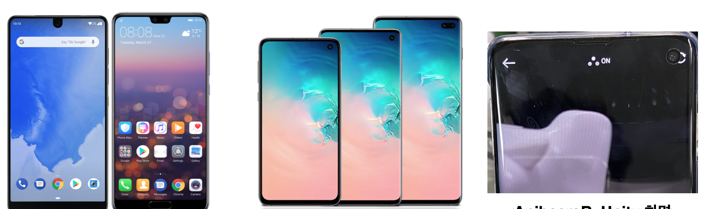
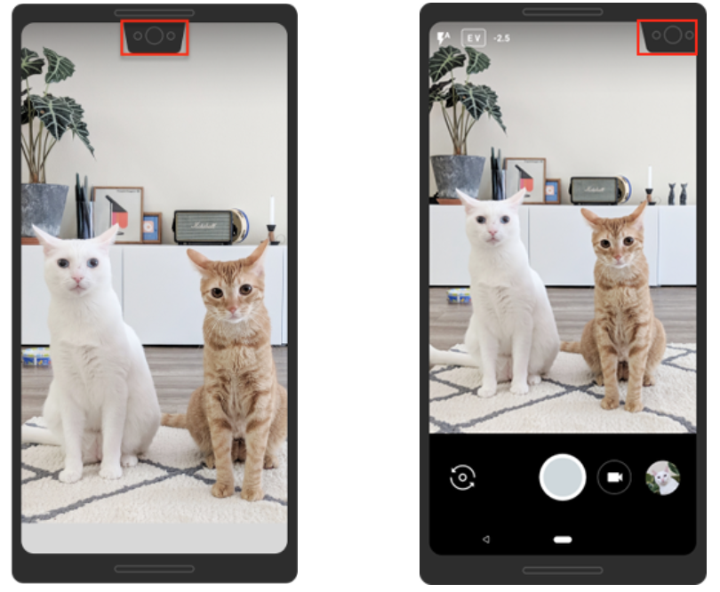
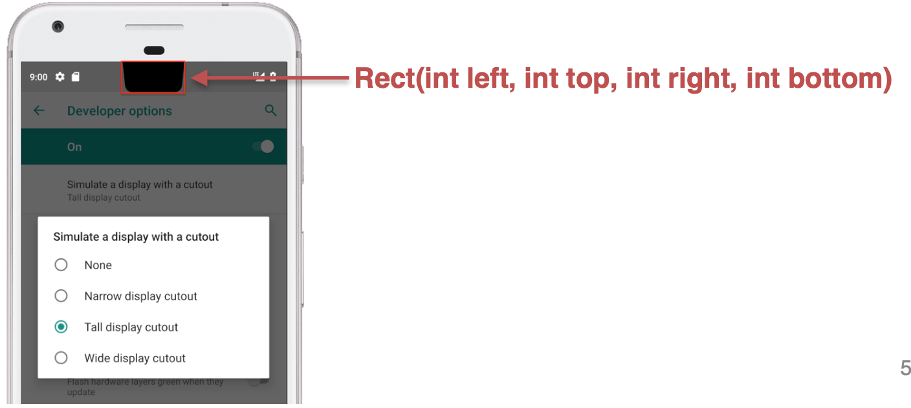

# FindCutoutCamera

> 아이폰 X에서는 Notch라 불리는 부분이 있는데,  
> 안드로이드 에서는 Android 9 (API 레벨 28) 지원하는    
단말기 부터 추가되었습니다.  

> 이름은 Notch가 아닌 Cutout로 불립니다.    
> Cutout(Notch)에는 UI적 이슈가 있습니다.    
> FullScreenDisplay때 Cutout부분을 처리를 못한다는 점입니다.    
> Android도 이러한 부분을 피하지는 못하고,     
> 하드웨어적인 이슈를 해결하기 전까지는 이러한 UI가 유지 될듯합니다.    

>Android에서는 Cutout대하여 대안으로 ‘DisplayCutout’을 내놓았습니다.  ‘DisplayCutout’은 Android 9 (API 레벨 28) 이상을 실행하는 기기에서 지원합니다.  
  
>컷 아웃 영역, 즉 컷 아웃이 포함 된 디스플레이 표면의 가장자리에서 직사각형으로 작업하는 방법을 포함하여 컷 아웃이있는 장치에 대한 지원을 구현하는 방법을 제시합니다.  

>이 방법을 응용하면 Camera Cutout(Notch)의 UI처리가 가능합니다.  
>  
> `해당 프로젝트 문서는 프로젝트 내부에 .pdf파일로 저장되어있습니다.`  
> 파일명 : DisplayCutout_document.pdf
